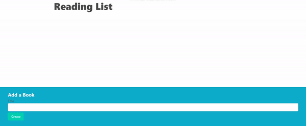

# React - Reading List App

- Add, edit and delete an item (book).
- Random cover image will be added using [Picsum photos](https://picsum.photos/) every item addition.
- json-server used as database, and db.json file to store books.

## This project is from [Stephen Grider's Modern React Course](https://www.udemy.com/course/react-redux/)
